# 🚀 Next.js Project - Installation & Setup Guide  

## I. Clone the Project  
First, download the source code by running:  
```bash
git clone https://github.com/Nhannguyenus24/Student-Management-System.git
cd student-management
```

## II. Install Dependencies
Since the node_modules folder is not included in the repository, you need to reinstall dependencies:
```bash
npm install  # If using npm
# or
yarn         # If using yarn
# or
pnpm install # If using pnpm
# or
bun install  # If using bun
```

## III. Run the Development Server
After installing dependencies, start the development server:
```bash
npm run dev
# or
yarn dev
# or
pnpm dev
# or
bun dev
```
Then open your browser and visit: http://localhost:3000

## IV. Deploy to Vercel
To deploy the project on Vercel, run:
```bash
npx vercel
```
Or use the web interface: https://vercel.com/new

## V. Important notes
This project uses Next.js, so ensure Node.js >= 18. Check your Node.js version with:
```bash
node -v
```
If you encounter issues, try the following:
```bash
rm -rf node_modules package-lock.json
npm install
```

# 🎓 Student Management System - Version 1 Features 
## I. Display student information
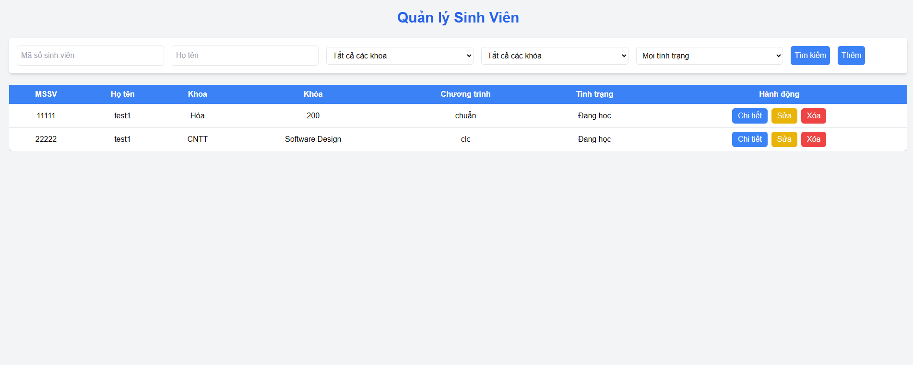
- This feature displays a list of students who have been added to the student management system. For better UI/UX, only key information is shown. To view full student details, click the "Detail" button above.
## II. Search student information

- This feature allows users to search for students by their identification number, name (including partial matches), faculty (Law, Business English, Japanese, French), course, and study status (Enrolled, Graduated, Withdrawn, Temporarily Suspended). The server will filter the information and return the results to the user. 
- After entering the desired search criteria in the filter bar, click the "Search" button to apply the filter.
## III. Add student information
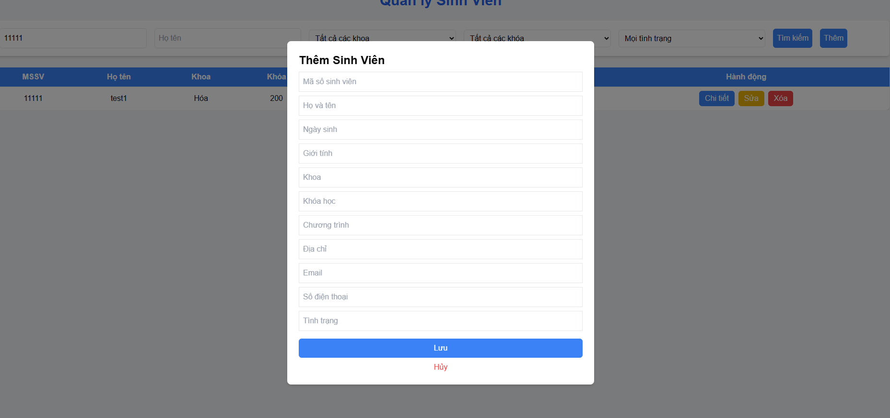
- This feature allows users to add a new student to the database.
- After entering all the required information, click "Save" to add the new student or "Cancel" to discard the action and return to the student list screen.
## IV. Edit student information
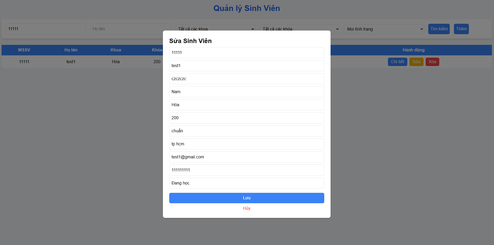
- This feature allows users to edit a new student to the database.
- After entering all the required information, click "Save" to add the new student or "Cancel" to discard the action and return to the student list screen.

# 🎓 Student Management System - Version 2 Features 
## I. Add or edit Faculty or Status
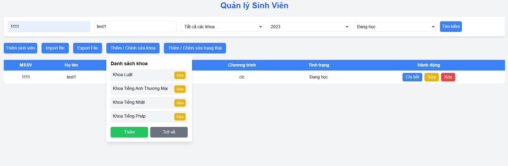
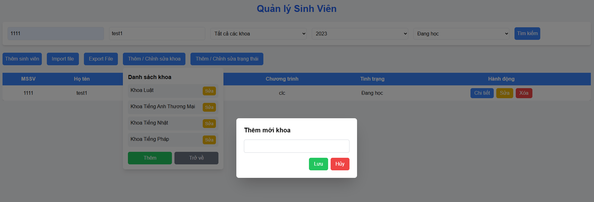
- Users can now edit the list of faculties and statuses or add more options to choose from.
## II. Search improve
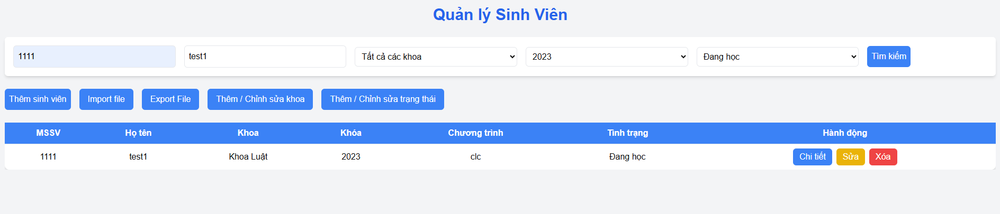
- Users can now filter the student list by `name`, `student identification`, `faculty`, `year`, and `status`.
## III. Import/ Export data
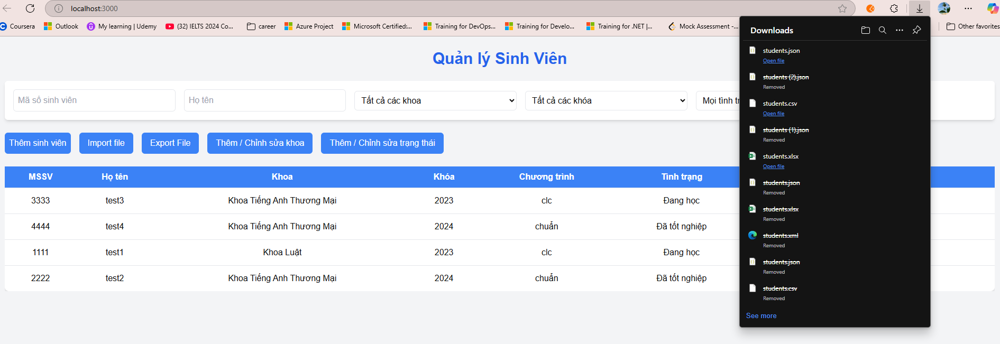
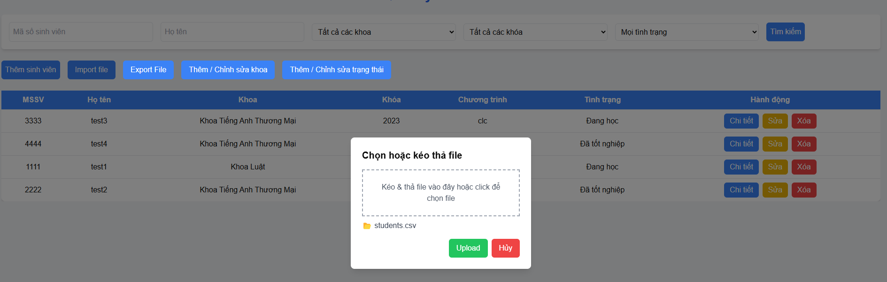
- This Export feature allows users to export data in four file formats (JSON, Excel, XML, or CSV). Users can click the "Export File" button under the filter bars, select a file type, and the browser will automatically download the file.
- This Import feature allows users to import data from four file formats (JSON, Excel, XML, or CSV). Users can click the "Import File" button under the filter bars, select a file to import.
## IV. Add Log mechanism
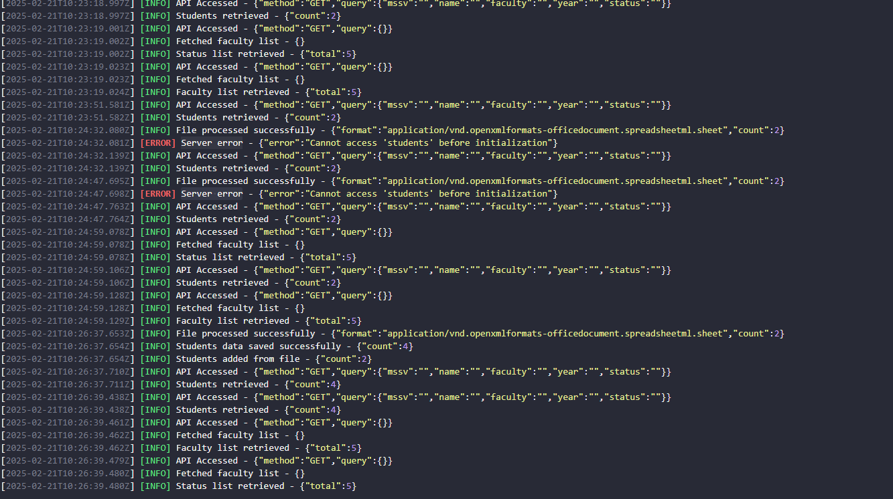
- This feature allows developers to easily log and fix errors from API calls, storing them in the `app.log` file.
## V. Show version and build date
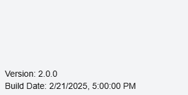
- This feature allows users to view the version and build date of the web app.

# 🎓 Student Management System - Version 3 Features
## I. Add validate for email and phone number
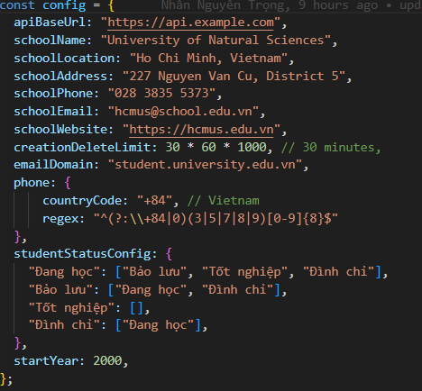
- This feature will validate student emails and phone numbers. The email must follow the format @student...edu.vn, and the phone number must be valid in Vietnam. Additionally, the program will check if a student with the same ID already exists before adding a new one.
## II. Disable option status student
- Once a student has graduated, they cannot be reverted to undergraduate status. That option will be disabled.
## III. Configuration
- Each checking valid phone, email or change status can be config in `config.js`.

# 🎓 Student Management System - Version 4 Features
## I. Students can only be deleted if their creation date/time falls within a specified (configurable) time range

- This feature allow to deleted student within 30 minutes, config in code (creationDeleteLimit). It can be change in `config.js`. 
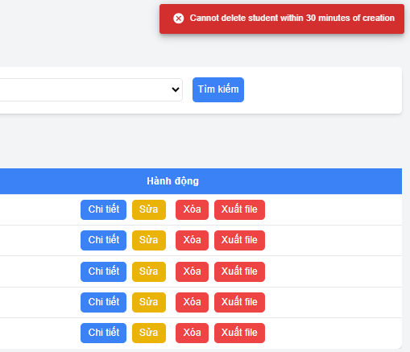

## II. Show logo or school name
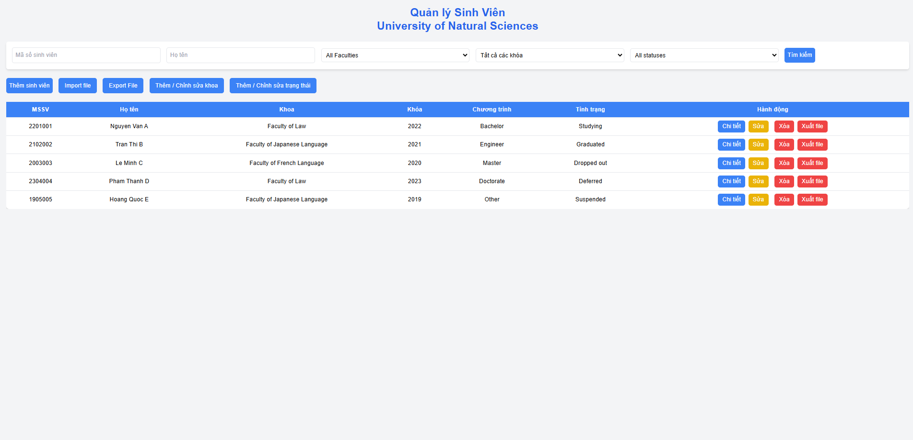
- This feature allows the main screen to display the school name, which can be configured in `config.js`.

## III. Student status, program, and faculty can be deleted if there are no data constraints
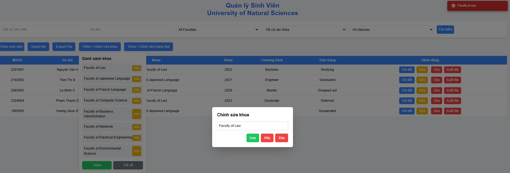
- This feature checks if a faculty, program, or status is in use. If they are, they cannot be edited or deleted; otherwise, they can.

## IV. Export student status confirmation to HTML/MD/PDF/DOCX 
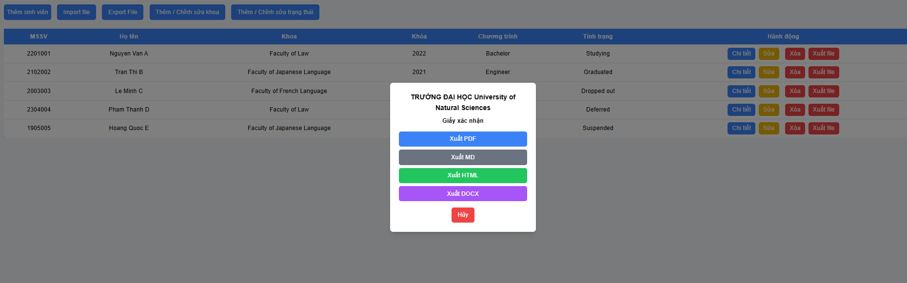
- When clicking "Export file" in the student information row, there will be four options to choose from for exporting the student status confirmation.

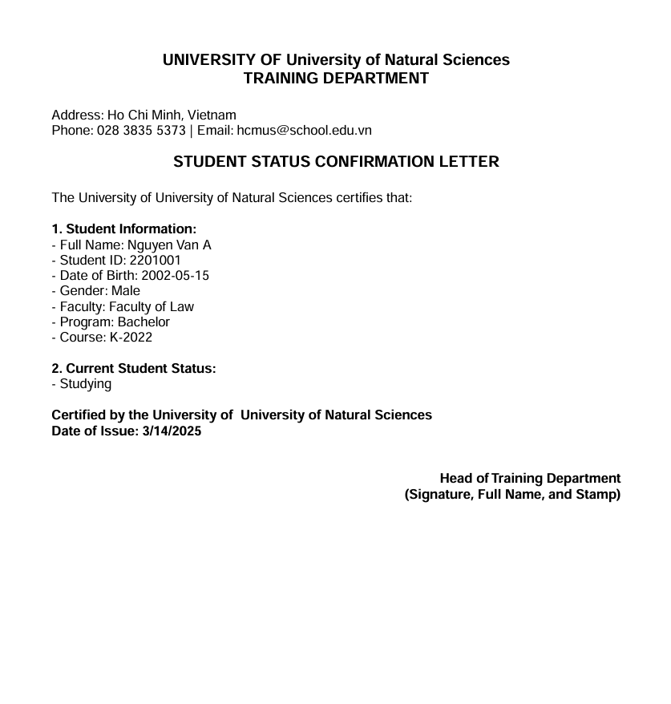
- PDF format

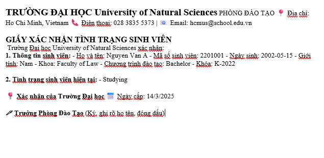
- DOCX format

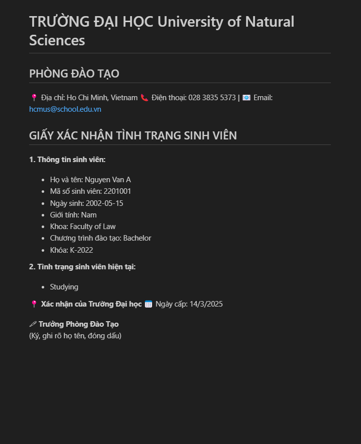
- MD format

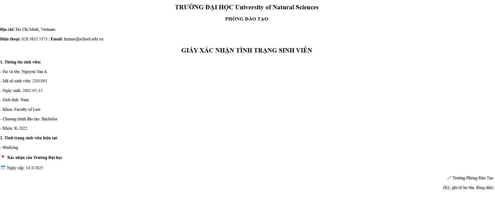
- HTML format

## V. Good Techniques in Use and Improvements
01. Don't Repeat Yourself (DRY)
- Functions that are used repeatedly, such as logging functions, email and phone number validation, and functions for reading and writing JSON files, are declared in `utils.js` for reusability. This makes the code more concise and easier to maintain.

02. Backend Data Validation and Business Logic Enforcement
- Centralizing business logic and validation in the backend helps prevent inconsistencies and ensures data integrity across the system. By enforcing validation at the backend level, unnecessary API calls are minimized, improving performance and reducing server load. Additionally, backend validation prevents incorrect or inconsistent data from being processed or stored, reducing the risk of data logic errors and maintaining accuracy. It also enhances security by preventing potential exploits, such as bypassing client-side validation or sending manipulated requests. A well-structured backend with centralized validation improves maintainability, making the codebase easier to debug, extend, and manage without introducing unexpected errors.

03. UI consistency 
- The UI is designed to be as simple as possible while remaining user-friendly and displaying all necessary information.

04. Performance Optimization
- Utilize caching techniques to store and update data directly instead of waiting for API fetch requests to retrieve the latest data.